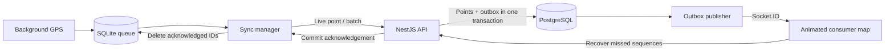

# NexusFleet

[](https://github.com/rayanakarthikeyan/NexusFleet/actions/workflows/ci.yml)

An offline-first fleet tracking demo built with React Native, Expo, NestJS and PostgreSQL.

A driver can lose cellular coverage halfway through a trip. NexusFleet saves each GPS fix to SQLite before sending it, uploads the backlog when delivery resumes, and replays the route on a second device. The demo includes a **Simulate Network Drop** switch so this behavior can be shown without finding a dead zone.

## The failure case that matters

The server commits a batch, but the phone never receives the response. Clearing the queue would risk loss; assigning new IDs on retry would duplicate the route.

NexusFleet keeps the original IDs and retries. PostgreSQL commits each ID once, and the phone deletes only the IDs acknowledged by the server. This is at-least-once delivery with an idempotent database effect.



## Try the demo

The [1.0.1 phone build on EAS](https://expo.dev/accounts/rayanakarthikeyan/projects/nexusfleet/builds/d7fd3ab8-429a-490b-bf88-10011703cff6) includes Driver and Viewer email/password sign-ins. Download its APK after EAS reports a successful build. This smaller build targets ARM64 Android phones and uses the hosted Render/Neon API and the free OpenFreeMap basemap; Metro and a map API key are not required.

The earlier [1.0.0 standalone APK](https://expo.dev/artifacts/eas/aAnk1gV-ivbnHGLIvLE_Gms9LGlbmuh5Llcywy3_JeM.apk) (versionCode 2) remains available with trip-code sign-in. Its [release](https://github.com/rayanakarthikeyan/NexusFleet/releases/tag/v1.0.0-demo) includes a SHA-256 checksum.

1. Use the supplied demo Driver and Viewer (user) email/password accounts in version 1.0.1, or seed your own accounts using the [local setup guide](docs/local-setup.md). The older 1.0.0 APK uses trip access codes.
2. Install the APK on two Android devices. Sign in as Driver on the tracking phone and Viewer on the second phone.
3. Start a trip, enable **Simulate Network Drop**, and move with the driver phone. Its queue count grows.
4. Disable the switch. The queue drains after commit acknowledgements, and the viewer plays the saved route in catch-up mode.

The [demo checklist](docs/demo.md) also covers real network loss, process restarts and lost responses.

## Run it locally

Use Node 22 and PostgreSQL 16 or later. Docker Compose supplies a local database.

```powershell
npm ci
Copy-Item .env.example .env
Copy-Item backend/.env.example backend/.env
```

Set the database password in both files. In `backend/.env`, set matching `DATABASE_URL` and `DIRECT_URL` values and generate a random `JWT_SECRET` of at least 32 characters. Then:

```powershell
docker compose up -d
npm run db:migrate --workspace backend
npm run dev --workspace backend
```

In another terminal, `npm run seed:demo --workspace backend` creates the two demo accounts after you set their passwords in `backend/.env`. `npm run provision --workspace backend` remains available for trip access codes. The same APK has separate Driver and Viewer sign-ins, remembered independently. See [Android installation troubleshooting](docs/android-install.md) if your phone rejects the download. Mobile setup requires a reachable API URL; MapLibre renders OpenFreeMap tiles without an API key. See the [full setup](docs/local-setup.md).

## What’s in the repo

| Area                               | Main responsibility                                                       |
| ---------------------------------- | ------------------------------------------------------------------------- |
| `mobile/services/LocalDatabase.ts` | Atomic GPS capture, serialized SQLite access, exact-ID deletion           |
| `mobile/services/SyncManager.ts`   | Single-flight uploads, stable-ID retries, socket-to-HTTP fallback         |
| `mobile/services/LocationTask.ts`  | Background task registration and Android tracking lifecycle               |
| `mobile/screens/ConsumerMap.tsx`   | Sequence recovery, smooth marker movement and catch-up playback           |
| `backend/src/telemetry/`           | Validated ingestion, trip authorization, history and Socket.IO broadcasts |
| `backend/prisma/`                  | Schema and committed migrations                                           |
| `render.yaml`                      | One Render Free gateway using an external Neon database                   |
| `.github/workflows/ci.yml`         | Formatting, type checks and integration tests against PostgreSQL          |

## Engineering decisions

- **Persist before sending.** A healthy socket is not proof that the server stored a location.
- **Keep network calls outside SQLite transactions.** GPS capture continues while an upload waits for a response.
- **Allocate sequences under a trip row lock.** History cursors cannot advance past an earlier uncommitted point.
- **Commit broadcast intent with the points.** An API restart can retry publication; viewers recover missed events from history.
- **Animate native marker props.** Reanimated moves coordinates over 1000 ms and takes the shortest heading turn. Catch-up compresses the playback interval.

The [architecture guide](docs/architecture.md) contains the protocol, interpolation math and operating limits. [IMPLEMENTATION.md](IMPLEMENTATION.md) is a generated file-by-file source reference; edit the runnable files and regenerate it with `npm run docs:source`.

## Checks

```powershell
npm run format:check
npm run build:backend
npm run check:mobile
npm test
```

Database tests require `TEST_DATABASE_URL` pointing to a separate, migrated test database. Without it, integration tests skip explicitly. CI supplies PostgreSQL and runs them. Tests cover concurrent retries, lost acknowledgements, conflicting IDs, transaction rollback, trip authorization, room isolation and history recovery, plus pure mobile queue/acknowledgement/math helpers.

## Deployment and current limits

The deployment target remains **Render Free + Neon Free + EAS Free**. Follow [the deployment runbook](docs/deployment.md) for account setup, migrations and APK builds.

This is a portfolio demo, with operator-seeded email/password accounts and optional trip access codes. A production rollout still needs an identity and renewal flow, retention rules, monitoring, and physical-device validation. Run one gateway instance; multiple replicas require a shared Socket.IO adapter and outbox leasing. Android force-stop, revoked permissions or erased app storage can interrupt capture or remove saved data.

The demo API is live at [nexusfleet-api.onrender.com](https://nexusfleet-api.onrender.com/health), backed by Neon Free. HTTPS ingestion, WebSocket delivery, duplicate retries and role access were verified against the hosted service. Native background tracking, SQLite behavior and marker animation still need testing on a physical Android device.

Unresolved dependency advisories are tracked in [maintenance notes](docs/maintenance.md).
