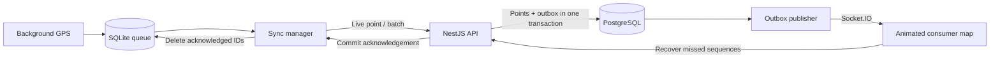

# NexusFleet

[](https://github.com/rayanakarthikeyan/NexusFleet/actions/workflows/ci.yml)

An offline-first fleet tracking demo built with React Native, Expo, NestJS and PostgreSQL.

A driver can lose cellular coverage halfway through a trip. NexusFleet saves each GPS fix to SQLite before sending it, uploads the backlog when delivery resumes, and replays the route on a second device. The demo includes a **Simulate Network Drop** switch so this behavior can be shown without finding a dead zone.

## The failure case that matters

The server commits a batch, but the phone never receives the response. Clearing the queue would risk loss; assigning new IDs on retry would duplicate the route.

NexusFleet keeps the original IDs and retries. PostgreSQL commits each ID once, and the phone deletes only the IDs acknowledged by the server. This is at-least-once delivery with an idempotent database effect.



## Try the demo

1. Start the backend and provision a trip using the [local setup guide](docs/local-setup.md).
2. Install the APK on two Android devices. Connect one with the driver code and the other with the viewer code.
3. Start a trip, enable **Simulate Network Drop**, and move with the driver phone. Its queue count grows.
4. Disable the switch. The queue drains after commit acknowledgements, and the viewer plays the saved route in catch-up mode.

The [demo checklist](docs/demo.md) also covers real network loss, process restarts and lost responses.

## Run it locally

Use Node 22 and PostgreSQL 16 or later. Docker Compose supplies a local database.

```powershell
npm ci
Copy-Item .env.example .env
Copy-Item backend/.env.example backend/.env
```

Set the database password in both files. In `backend/.env`, set matching `DATABASE_URL` and `DIRECT_URL` values and generate a random `JWT_SECRET` of at least 32 characters. Then:

```powershell
docker compose up -d
npm run db:migrate --workspace backend
npm run dev --workspace backend
```

In another terminal, `npm run provision --workspace backend` creates a trip and prints its two access codes. Mobile setup requires a reachable API URL and a restricted Google Maps Android key; see the [full setup](docs/local-setup.md).

## What’s in the repo

| Area                               | Main responsibility                                                       |
| ---------------------------------- | ------------------------------------------------------------------------- |
| `mobile/services/LocalDatabase.ts` | Atomic GPS capture, serialized SQLite access, exact-ID deletion           |
| `mobile/services/SyncManager.ts`   | Single-flight uploads, stable-ID retries, socket-to-HTTP fallback         |
| `mobile/services/LocationTask.ts`  | Background task registration and Android tracking lifecycle               |
| `mobile/screens/ConsumerMap.tsx`   | Sequence recovery, smooth marker movement and catch-up playback           |
| `backend/src/telemetry/`           | Validated ingestion, trip authorization, history and Socket.IO broadcasts |
| `backend/prisma/`                  | Schema and committed migrations                                           |
| `render.yaml`                      | One Render Free gateway using an external Neon database                   |
| `.github/workflows/ci.yml`         | Formatting, type checks and integration tests against PostgreSQL          |

## Engineering decisions

- **Persist before sending.** A healthy socket is not proof that the server stored a location.
- **Keep network calls outside SQLite transactions.** GPS capture continues while an upload waits for a response.
- **Allocate sequences under a trip row lock.** History cursors cannot advance past an earlier uncommitted point.
- **Commit broadcast intent with the points.** An API restart can retry publication; viewers recover missed events from history.
- **Animate native marker props.** Reanimated moves coordinates over 1000 ms and takes the shortest heading turn. Catch-up compresses the playback interval.

The [architecture guide](docs/architecture.md) contains the protocol, interpolation math and operating limits. [IMPLEMENTATION.md](IMPLEMENTATION.md) is a generated file-by-file source reference; edit the runnable files and regenerate it with `npm run docs:source`.

## Checks

```powershell
npm run format:check
npm run build:backend
npm run check:mobile
npm test
```

Database tests require `TEST_DATABASE_URL` pointing to a separate, migrated test database. Without it, integration tests skip explicitly. CI supplies PostgreSQL and runs them. Tests cover concurrent retries, lost acknowledgements, conflicting IDs, transaction rollback, trip authorization, room isolation and history recovery, plus pure mobile queue/acknowledgement/math helpers.

## Deployment and current limits

The deployment target remains **Render Free + Neon Free + EAS Free**. Follow [the deployment runbook](docs/deployment.md) for account setup, migrations and APK builds.

This is a portfolio demo, with operator-issued trip credentials. A production rollout still needs an identity and renewal flow, retention rules, monitoring, and physical-device validation. Run one gateway instance; multiple replicas require a shared Socket.IO adapter and outbox leasing. Android force-stop, revoked permissions or erased app storage can interrupt capture or remove saved data.

The repo does not yet include a published APK or a verified hosted demo URL. Native background tracking, SQLite behavior and marker animation need testing on a physical Android device.

Unresolved dependency advisories are tracked in [maintenance notes](docs/maintenance.md).
